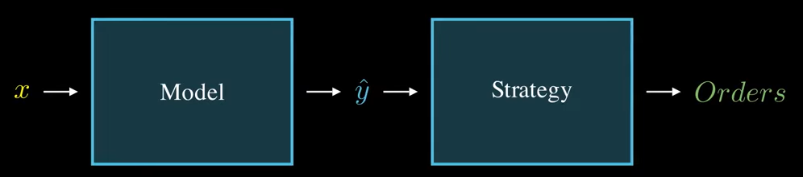
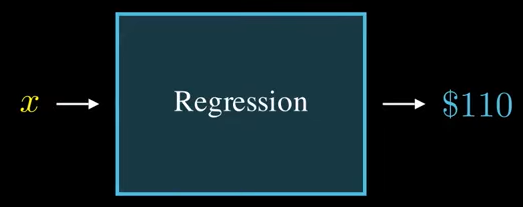
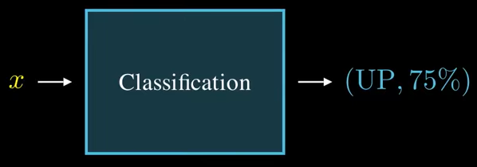
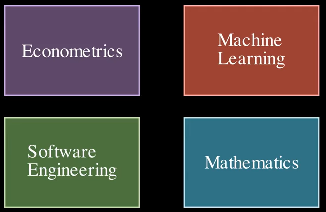
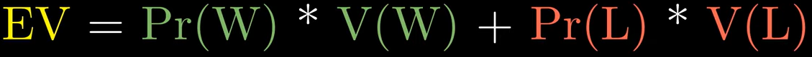
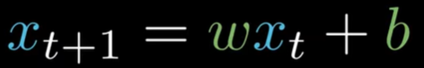

## Introduction to Quantitative

https://www.youtube.com/watch?v=mkzcntzznMc

### Fundamental

**模型（Model）**產生優勢，**策略（Strategy）**負責執行。兩者同樣重要，缺一不可。

回歸模型（Regression）：預測數值，如未來價格、價格變動（Delta）或收益率。

分類模型（Classification）：預測類別，如價格上漲或下跌的機率。

### Skills

### Statistical Edge

**期望值（EV）**：衡量每筆交易平均能賺多少錢。影片強調應關注 EV 而非單純的勝率，即便勝率僅 51%，只要 EV 為正，長期就能獲利。

**Sharpe Ratio 公式**：$$\text{Sharpe Ratio} = \frac{E[R_p] - R_f}{\sigma_p}$$$E[R_p]$ 是預期收益。$R_f$ 是無風險利率（如國債收益率）。$\sigma_p$ 是收益率的標準差。

| 夏普比率區間 | 評價               | 說明                                                                      |
| ------------ | ------------------ | ------------------------------------------------------------------------- |
| < 1.0        | 尚可               | 許多被動指數型基金（如 S&P 500）長期大約落在 0.5 ~ 0.8 之間。             |
| 1.0 ~ 2.0    | 優秀 (Good)        | 代表每承擔 1 單位風險，能換回 1 到 2 單位收益，是專業對沖基金追求的目標。 |
| 2.0 ~ 3.0    | 極佳 (Very Good)   | 非常優質的量化策略，在實盤中能長期維持此數值非常罕見且具競爭力。          |
| > 3.0        | 卓越 (Exceptional) | 在回測中很常見（通常是過擬合），但在實盤中通常出現在高頻交易（HFT）中。   |

**對數收益率（Log Returns）**：相比簡單收益率，對數收益率具有對稱性與時間可加性，更適合機器學習模型處理

- 簡單收益率的非對稱：價格從 100 漲到 120（+20%），再從 120 跌回 100（-16.6%）。數值不對等，這會讓機器學習模型感到困惑。

- 對數收益率的對稱：價格從 100 到 120（+18.23%），從 120 到 100（-18.23%）。數值完全相等，正負號代表方向，絕對值代表強度，這對模型訓練非常友善。

### Model

**Linear Regression**: x = Input, b = Bias, w = Weight

